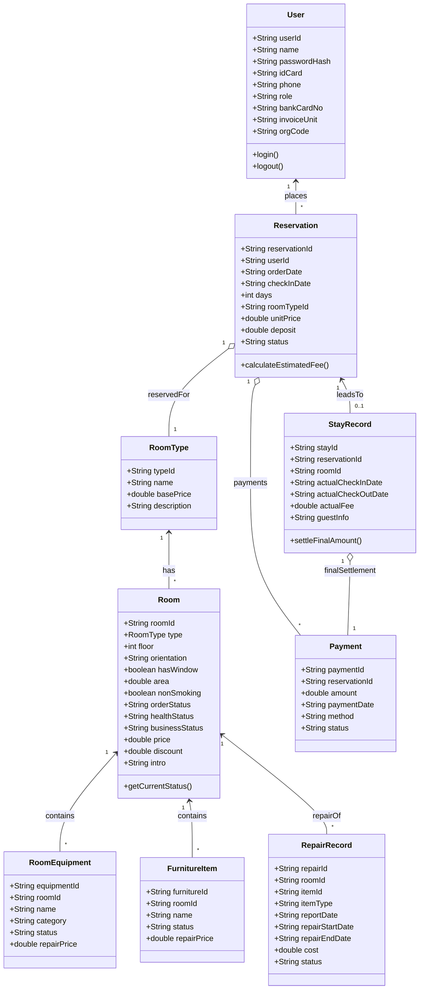

# 代码重构文档模板

- 姓名：[填写你的姓名]
- 学号：[填写你的学号]
- 重构模块：[填写你负责重构的模块/类名]

---

## 1. 原始代码存在的问题

### 1.1 问题描述

[详细描述原始代码存在的具体问题，例如：]

- 违反了哪些面向对象设计原则（SOLID原则）
- 代码耦合度高、内聚度低
- 可维护性差、扩展性不足
- 代码重复、结构混乱
- 性能问题等

### 1.2 问题示例

```cpp
// 展示原始代码中存在问题的关键代码片段
// 添加注释说明具体问题所在
```

---

## 2. 重构思路与设计模式分析

### 2.1 选用的设计模式

**设计模式名称：** [例如：策略模式、工厂模式、单例模式等]

### 2.2 设计模式简介

[对所选用的设计模式进行简单介绍，包括：]

- **定义：** 该设计模式的基本概念和作用
- **结构：** 该模式的基本组成部分
- **应用场景：** 什么情况下适合使用这个模式

### 2.3 选择该设计模式的理由

[解释为什么选择这个设计模式来解决当前问题：]

- 该模式如何解决原代码的具体问题
- 与其他可选方案相比的优势
- 该模式带来的具体好处

### 2.4 重构设计思路

[描述具体的重构策略，比如：]

- 如何将原代码重新组织
- 新的类结构设计
- 接口和抽象的设计
- 职责分离的方案

---

## 3. 重构后的代码实现

### 3.1 核心代码变更对比

文字简单介绍一下此次重构的核心部分的代码，比如核心和上层的类，详细的变更在下面写。

**原始代码：**

```cpp
// 原始代码实现
// 保持原有的代码缩进和格式
class OldClass {
    // 原有的混乱实现
};
```

**重构后代码：**

```cpp
// 重构后的代码实现
// 展示使用设计模式后的清晰结构
class NewClass {
    // 新的优化实现
};
```

### 3.2 详细变更说明

**变更的文件：**

- `文件名1.cpp/h` - [变更描述]
- `文件名2.cpp/h` - [变更描述]

**核心变更点：**

```diff
- // 删除的代码（原有的问题代码）
+ // 新增的代码（重构后的优化代码）
```

---

## 4. UML类图说明

### 4.1 重构前类图

下面是类图示例



### 4.2 重构后类图

同理

### 4.3 类图对比分析

[对比两个类图，说明：]

- 结构上的主要变化
- 设计模式在类图中的体现
- 关系简化或优化的地方

---

## 5. 重构解决的问题和收益

### 5.1 解决的具体问题

- **问题1：** [原问题] → [如何被解决]
- **问题2：** [原问题] → [如何被解决]
- **问题3：** [原问题] → [如何被解决]

### 5.2 获得的收益

**代码质量提升：**

- 可读性：[具体改进]
- 可维护性：[具体改进]
- 可扩展性：[具体改进]

**设计原则遵循：**

- 单一职责原则：[如何体现]
- 开闭原则：[如何体现]
- 其他相关原则：[如何体现]

**性能优化：**

- [如果有性能优化，描述具体改进]

---

## 6. 重构过程反思与总结

### 6.1 重构过程中的挑战

- **挑战1：** [遇到的具体困难]
  - 解决方案：[如何克服]
- **挑战2：** [遇到的具体困难]
  - 解决方案：[如何克服]

### 6.2 经验教训

- **设计模式应用心得：** [对所用设计模式的理解和体会]
- **代码重构技巧：** [在重构过程中学到的技巧]
- **需要改进的地方：** [自我反思，还有哪些可以做得更好]

### 6.3 对未来开发的启示

- [这次重构对今后编程实践的指导意义]
- [对设计模式使用的新认识]

---

## 7. AI工具使用情况

### 7.1 使用的AI工具

- **工具名称：** [例如：ChatGPT、GitHub Copilot、Claude等]

### 7.2 AI工具的具体应用

**代码分析阶段：**

- 使用AI工具分析原代码问题：[具体描述]
- AI提供的问题识别帮助：[具体说明]

**设计阶段：**

- AI在设计模式选择上的建议：[具体说明]
- AI提供的设计思路：[具体描述]

**编码实现阶段：**

- AI辅助代码编写的情况：[具体说明]
- AI生成的代码片段及修改：[如有使用，请说明]

**测试和调试阶段：**

- AI在问题诊断中的作用：[具体说明]
- AI提供的调试建议：[具体描述]

### 7.3 AI工具使用的最佳实践

**有效的使用方式：**

- [描述哪些AI交互方式最有效果]
- [什么样的问题询问方式得到更好的回答]

**注意事项：**

- [使用AI时需要注意的问题]
- [如何验证和优化AI提供的建议]

### 7.4 AI工具的局限性和挑战

**发现的局限性：**

- [AI在理解复杂业务逻辑方面的限制]
- [AI生成代码的质量问题]
- [需要人工判断和修正的地方]

**遇到的挑战：**

- [使用AI过程中的困难]
- [如何克服这些挑战]

### 7.5 对AI辅助编程的反思

**收获：**

- [AI工具带来的积极影响]
- [学习效率的提升]

**思考：**

- [对AI在软件开发中作用的认识]
- [未来AI工具发展的期望]

---

## 附录

### A. 相关文件清单

- [列出所有修改的文件名及简要说明]

### B. 参考资料

- [设计模式相关资料]
- [重构技术相关资料]
- [其他参考的技术文档]

---

**注意事项：**

1. 请根据你的具体重构内容填写每个部分
2. 代码示例要真实，确保语法正确
3. UML类图可以使用工具绘制后插入图片
4. AI工具使用情况真实记录，最好体现使用过程和思考
5. 每个部分都结合具体的重构实例来写，避免空泛的描述
6. 模板文档每个部分都有包含，实际可根据自己的部分对每个大标题下的小标题（三级）进行调整，但二级标题不可调整
